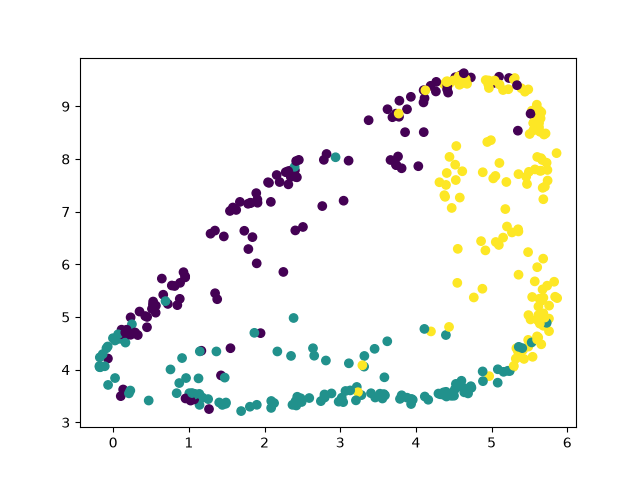

# UMAP-kNN-river
Reimplementación de UMAP-kNN (reducción de dimensionalidad y clasificación de datos) como está visto en el siguiente artículo.

[Maroua Bahri, Bernhard Pfahringer, Albert Bifet, Silviu Maniu. Efficient Batch-Incremental Classification for Evolving Data Streams. In the Symposium on Intelligent Data Analysis (IDA), 2020.]

Existe una implementación en el repo: https://github.com/marouabahri/UMAP-kNN que es obsoleta.
